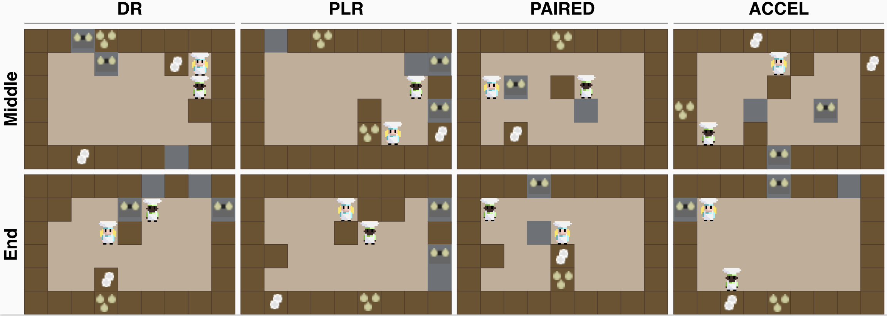

# `AMaze`

## 🧭 Partially-observable navigation in procedural mazes.



The `OvercookedUED` environment reproduces the Overcooked in its classical state as described by Carroll et al. (https://github.com/HumanCompatibleAI/overcooked_ai) while also adding parallelisation across layouts and the possibility to design layouts by a teacher agents.
Observation and action spaces are consistent with original and thus excluded from the description here.
The student environment is built by starting from the JaxMARL project: https://github.com/FLAIROx/JaxMARL.

## Student environment
View source: [`envs/overcooked_proc/overcooked.py`](../../src/minimax/envs/overcooked_proc/overcooked.py)

### Static EnvParams

Similar to the `AMaze` environment the parameters of the environment are described below.
The interaction with these env parameters is fundamentally the same.
All commands are command-line supported.

| Parameter | Description| Command-line support | 
| - | - | - |
| `height` | Height of Overcooked layout | ✅ |
| `width` | Width of Overcooked layout | ✅ |
| `h_min` | Minimum height of Overcooked layout | - |
| `w_min` | Minimum width of Overcooked layout | - |
| `n_walls` | Number of walls to place per Overcooked layout | ✅ |
| `replace_wall_pos` | Wall positions are sampled with replacement if `True` | ✅ |
| `normalize_obs`| Scale observation values to [0,1] if `True`| ✅ |
| `sample_n_walls` | Sample # walls placed between [0, `n_walls`] if `True` | ✅ |
| `max_steps` | Steps in Overcooked until termination | ✅ |
| `max_episode_steps` | Same as `max_steps` for consistency | ✅ |
| `singleton_seed` | Fix the random seed to this value, making the environment a singleton |  |

### State space
| Variable | Description|
| - | - |
| `agent_pos` | Agent's (x,y) position |
| `agent_dir` | Agent's orientation vector |
| `agent_dir_idx` | Agent's orientation enum |
| `agent_inv` | The agents inventory |
| `goal_pos` | Where serving locations are |
| `pot_pos` | Where pots are |
| `wall_map` | Boolean wall map |
| `maze_map` | hxwx3 map |
| `bowl_pile_pos` | Where bowl piles are |
| `onion_pile_pos` | Where onion piles are |
| `time` | N steps taken |
| `terminal` | Terminal step? |


## Teacher environment
View source: [`envs/overcooked_proc/overcooked_ued.py`](../../src/minimax/envs/overcooked_proc/overcooked_ued.py)

Also similar to `AMaze` we document the teacher environment below.
`UEDOvercooked` is the teacher's MDP for setting the env params described above.
Similar to above:

### Static EnvParams
| Variable | Description| Command-line support |
| - | - | - |
| `height` | Height of maze | ✅ |
| `width` | Width of maze | ✅ |
| `n_walls` | Wall budget | ✅ |
| `noise_dim` | Size of noise vector in the observation | ✅ |
| `replace_wall_pos` | If `True`, placing an object over an existing way replaces it. Otherwise, the object is placed in a random unused position. | ✅ |
| `fixed_n_wall_steps` | First `n_walls` actions are wall positions if `True`. Otherwise, the first action only determines the fraction of wall budget to use. | ✅ |
| `first_wall_pos_sets_budget` | First wall position also determines the fraction of wall budget to use (rather than using a separate first action to separately determine this fraction) | ✅ |
| `use_seq_actions` | Whether to use sequential actions, always true | ✅ |
| `normalize_obs` | If `True`, Scale observation values to [0,1] | ✅ |
| `sample_n_walls` | Whether to sample n walls | ✅ |
| `max_steps` | See above | ✅ |
| `singleton_seed` | See above | ✅ |
| `max_episode_steps` | See above | ✅ |


### State space
| Variable | Description|
| - | - |
| `encoding` | `A 1D vector encoding the running action sequence of the teacher` |
| `time` | `current time step` |
| `terminal` | `True` if the episode is done |

### Observation space
| Variable | Description|
| - | - |
| `image` | Full `maze_map` of the Overcooked instance under construction: hxwx3 |
| `time` | Time step |
| `noise` | A noise vector sampled from Uniform(0,1) |

### Action space
Similar to in `AMaze`, the action space corresponds to integers in [0,`height*width`]. Each action corresponds to a selected wall location in the flattened maze grid, with the exception of the last few actions, which place objects in the environment. This interpretation of the action sequence can change based on the specific configuration of `EnvParams`:

- If `params.replace_wall_pos=True`, the first action corresponds to the number of walls to place in the current episode.

- If `params.set_agent_dir=True`, an additional step is appended to the episode, where the action corresponds to the agent's initial orientation index.

The actions are: 
```python
class SequentialActions(IntEnum):
    skip = 0
    wall = 1
    goal = 2
    agent = 3
    onion = 4
    soup = 5
    bowls = 6
```

## OOD test environments
We include the original 5 and more layouts for OOD testing in [`envs/overcooked_proc/overcooked_ood.py`](../../src/minimax/envs/overcooked_proc/overcooked_ood.py)
